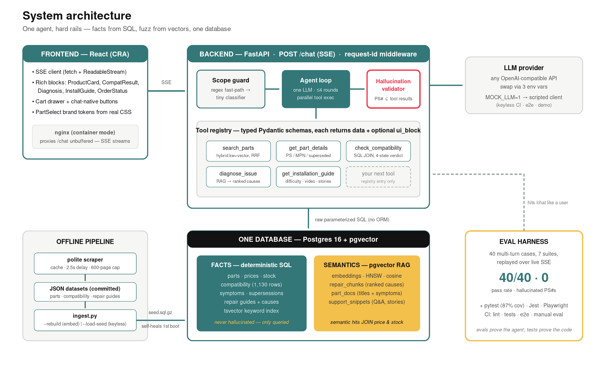
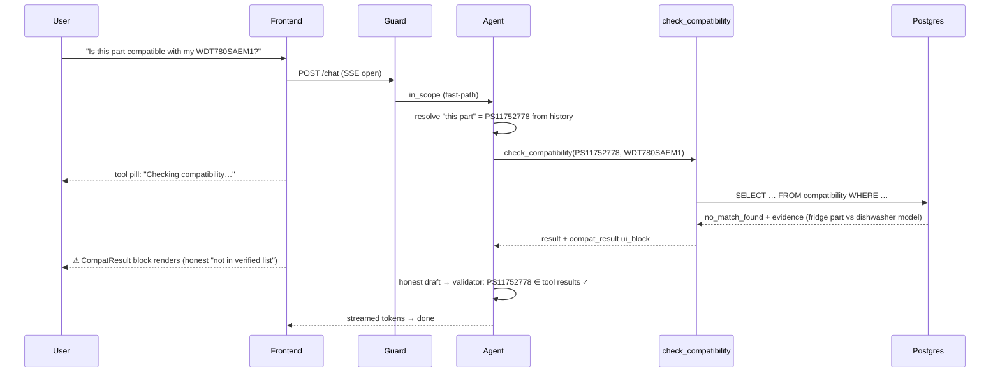

# PartSelect Chat Agent

> A grounded PartSelect chat agent that takes a customer from symptom to a
> verified part — with measured accuracy.

[](https://github.com/ScooterStuff/case-study/actions/workflows/ci.yml)

<!-- demo GIF: record per docs/media/README.md, then uncomment

-->

Scoped to **refrigerator and dishwasher parts**: diagnose a symptom, find the
right part, verify it fits your model, and get install help — in one
conversation, with rich in-chat components and zero invented part numbers.

## What it does

The agent handles four kinds of question end-to-end:

- **Installation** — _"How do I install PS11752778?"_ → an install-guide block with difficulty, time, an embedded video, and real customer repair stories.
- **Compatibility** — _"Does this part fit my WDT780SAEM1?"_ → a SQL-join verdict (✓ verified / ⚠ not-in-our-list / ❌ wrong-appliance) with the evidence the verdict is based on.
- **Diagnosis** — _"Ice maker on my Whirlpool fridge isn't working"_ → ranked causes from real repair guides, with suggested parts and a path into a compatibility check.
- **Product search** — _"Lower spray arm for my dishwasher"_ → product cards with real prices, real stock, and install difficulty.

Plus the small things that make it feel like a real repair companion:

- 📷 **Photo → model number** — snap the appliance sticker; client-side OCR (Tesseract.js, lazy-loaded) extracts the model number and pre-fills the next message as a parts search _or_ a compatibility check, depending on the conversation so far.
- 🔍 **"How I know this" trace** — every assistant message has a collapsible "explainability" panel: which tools the agent called, the exact arguments it sent, a one-line summary of each result, and the validator's verdict on every part number mentioned (✓ verified, ✗ stripped, • unknown). Built for developers and reviewers — black-box bots ask for trust; this earns it on purpose, and turns the demo into its own debug log.
- 🛡️ **Stays on topic** — politely deflects out-of-scope questions, redirects other-appliance ones, and ignores prompt-injection payloads while still answering any legitimate question buried inside.
- ⚡ **Streams** — tool pills show progress ("Checking compatibility…"), rich blocks render mid-stream, tokens appear fast — and fabricated part numbers never do.

The catalog is **120 real parts** scraped from PartSelect.com across four brands (Whirlpool, GE, Frigidaire, LG), with **3.7k compatibility rows** and **95 ranked diagnosis causes**. Prices and stock are real.

## Setup

Datasets and a database seed are **pre-committed** — no scraping and no
embedding key needed to run (`ingest.py --load-seed` happens automatically).

```bash
# Docker (zero local toolchain)
cp .env.example .env           # add your LLM key — or skip and use mock mode:
MOCK_LLM=1 MOCK_EMBEDDINGS=1 docker compose up --build
# → UI on http://localhost:3000, API on http://localhost:8000 (OpenAPI at /docs)

# Local dev
cp .env.example .env && make setup
docker compose up -d db && make ingest
make dev
```

**Prerequisites** — Docker Desktop, or for local dev: Python 3.11+, Node 18+,
and `make`. An OpenAI-compatible LLM key is _optional_ — `MOCK_LLM=1` ships a
deterministic scripted client for keyless demos and CI.

## Usage

Three canonical queries (also seeded as suggestion chips in the UI):

1. `How can I install part number PS11752778?`
2. `Is this part compatible with my WDT780SAEM1 model?` _(as a follow-up — "this part" resolves from history)_
3. `The ice maker on my Whirlpool fridge is not working. How can I fix it?`

Other query shapes that work:

- Natural-language description: _"the thing that sprays water in the bottom of my dishwasher"_
- Symptom only: _"my dishwasher is not draining"_
- Part type + brand: _"GE refrigerator water filter"_
- Compatibility for any PS#: _"does PS3406971 fit a Whirlpool WDT780SAEM1?"_

The composer also exposes a 📷 photo-OCR button, and every assistant message
has a **"How I know this"** toggle showing the agent's trace.

## How it works

Three layers, deliberately separated:

1. **Guard** — is this a question we should answer? A regex fast-path classifies obvious cases (`in_scope` / `out_of_scope` / `other_appliance` / `injection`) for free; only ambiguous messages pay for a cheap LLM classifier call. Each verdict has its own on-brand deflection.
2. **Tool-calling agent** — one LLM, one tool registry. The model picks the right tool, the tool runs deterministic SQL or pgvector retrieval, and the result returns as both raw data _and_ a `ui_block` payload the frontend renders mid-stream. Pronouns ("this part") resolve from session memory before any tool fires.
3. **Validator + stream** — every `PS#` the model wrote must exist in this turn's tool results. Failed validation triggers one targeted retry, then a strip-and-log fallback. The answer streams out as SSE: `tool_start` / `tool_end` (with args + summary) / `ui_block` / `token` / `trace` / `done`.

The deeper architecture — schema, hybrid search, the SQL-vs-vectors split — is
in the next section.

## Eval results (the part most chatbots skip)

The agent is **measured**, not vibes-checked: a 40-case harness replays
multi-turn conversations through the live SSE API and asserts tool selection,
answer content, scope behavior, and a mechanical hallucination check.

Full per-case table and methodology: [`eval/RESULTS.md`](eval/RESULTS.md) ·
cases: [`eval/cases.json`](eval/cases.json). Regenerate with `make eval`.
_The committed table is from the scripted `MOCK_LLM` client (provenance is in
the table's metadata line); re-run with your key for real-model numbers._

## Architecture

A user message first hits the **scope guard** (keyword fast-path, then a cheap
classifier only when needed — latency matters). In-scope messages go to a
**single tool-calling agent**: facts that must never be wrong (prices, stock,
compatibility) are answered from **relational tables via deterministic SQL**,
while fuzzy natural language (symptoms, "the thing that sprays water") is
answered via **RAG over pgvector embeddings in the same database** — which also
lets semantic hits JOIN prices and stock in one query. Every tool can attach a
**ui_block**, which the frontend renders as a rich component mid-stream. Before
the final answer flushes, a **validator** rejects any part number that didn't
come from a tool result.

**Compatibility is a database join, never an LLM guess** — and the data layer is
honest about its limits: a miss is reported as _"not in our verified list"_
(the scraped cross-reference is partial), never a hard "incompatible".



### Request lifecycle

1. **Scope guard** classifies the message as `in_scope` / `out_of_scope` /
   `other_appliance` / `injection`. Regex fast-path first; only ambiguous
   cases pay for an LLM classifier call.
2. **Agent loop** sends the message + recent history + tool schema to one
   LLM. Pronouns ("this part") resolve from session memory before any tool
   fires.
3. **Tool execution** runs deterministic SQL or pgvector retrieval. Each
   tool result includes the raw data _and_ a `ui_block` payload for the
   frontend to render mid-stream.
4. **Honest draft → validator** — every `PS#` the model wrote must appear in
   this turn's tool results. Failed validation triggers one targeted retry,
   then a strip-and-log fallback.
5. **Stream out** as SSE: `tool_start` / `tool_end` (with args + summary) /
   `ui_block` / `token` / `trace` / `done`.

### Two-track data layer (one Postgres)

| Track          | Used for                                                         | How                                                                 |
| -------------- | ---------------------------------------------------------------- | ------------------------------------------------------------------- |
| **SQL facts**  | prices · stock · compatibility · install difficulty · `replaces` | normalized tables + `tsvector` for keyword search                   |
| **Vector RAG** | symptoms · descriptions · Q&A snippets                           | pgvector `embeddings` table, joined back to `parts` for price/stock |

Hybrid search uses **reciprocal-rank fusion** of `tsvector` and pgvector
results (with an OR-mode tsquery fallback for verbose natural-language
queries). Compatibility, prices, and stock are _never_ retrieved by
similarity — those columns are SQL or nothing.

### Tools (the extension point)

| Tool                     | Backed by                           | Returns ui_block |
| ------------------------ | ----------------------------------- | ---------------- |
| `search_parts`           | hybrid (tsvector + vector)          | `product_list`   |
| `get_part_details`       | SQL on `parts`                      | `product_card`   |
| `check_compatibility`    | SQL join `compatibility`            | `compat_result`  |
| `diagnose_issue`         | vector RAG over repair causes + SQL | `diagnosis`      |
| `get_installation_guide` | SQL + structured guides             | `install_guide`  |

Adding a tool is one Pydantic schema + one function; adding a new appliance
is a [TOML edit](backend/app/appliances.toml) + seed URLs (the schema, guard,
and prompt all rebuild from the TOML at import time).

### Data sourcing

The catalog isn't synthetic — `scraper/` is a polite, cached scraper of
PartSelect.com that produced **120 real parts** (refrigerator + dishwasher,
Whirlpool / GE / Frigidaire / LG), with **3.7k compatibility rows** and
**95 ranked diagnosis causes**. `ingest.py` normalizes the scraped JSON into
relational tables and embeds the descriptive text with
`text-embedding-3-small`. A pre-built seed dump ships in the repo so
`docker compose up` works keyless and offline.

<details>
<summary>Sequence diagram — the deterministic compatibility path</summary>



</details>

## Engineering features

The "What it does" section is what users see; these are the rails that make it
safe.

- **Hallucination gate** — every `PS#` in a draft must exist in this conversation's tool results; violations are retried once, then stripped and logged (`backend/data/hallucination_log.jsonl` stays empty across the 40-case eval).
- **Hold-and-validate final flush** — tokens stream during tool execution, but the final prose is buffered until the validator clears it. Worst-case ~100ms; mechanical zero-hallucination guarantee.
- **Chat-native navigation** — "Check fits my model" and "Install guide" buttons inside ui*blocks send templated messages back to the agent; the conversation \_is* the UI.
- **Keyless demo mode** — `MOCK_LLM=1` swaps in a deterministic, tool-faithful scripted client. CI and the docker-compose demo run with zero API keys.

<!-- screenshots: docs/media/block-*.png (see docs/media/README.md) -->

## Testing & quality

> Evals measure whether the _agent_ is right; tests measure whether the _code_
> is correct. They're separate layers on purpose.

| Layer         | What                                                                 | Run         |
| ------------- | -------------------------------------------------------------------- | ----------- |
| Unit (many)   | parsers, retrieval SQL, guard, validator, tools, agent loop          | `make test` |
| Integration   | FastAPI TestClient over real Postgres+pgvector (embedded `pgserver`) | `make test` |
| Frontend      | Jest + RTL: blocks, SSE chunk-reassembly, composer keys              | `make test` |
| Agent quality | 40-case eval harness                                                 | `make eval` |

Backend coverage **83%** (CI gate ≥80%). Lint: ruff (+bandit rules) and
ruff-format, enforced by CI and pre-commit. CI: backend / frontend on
every push; eval is a manual workflow (needs an LLM secret, costs money).

## Design decisions (full log: [`playbook/TRADEOFFS.md`](playbook/TRADEOFFS.md))

> Library-level choices (FastAPI vs Flask, pgvector vs Pinecone, Tesseract.js
> vs cloud OCR, …) and what would make us revisit them are catalogued in
> [`docs/TECH_STACK.md`](docs/TECH_STACK.md).

| Decision                                       | Why                                                  | Revisit when                  |
| ---------------------------------------------- | ---------------------------------------------------- | ----------------------------- |
| One Postgres for facts **and** vectors         | semantic hits JOIN price/stock in-db; one `up`       | ~1M embeddings                |
| Raw SQL, no ORM                                | ~10 queries; the SQL _is_ the architecture demo      | schema churn 3×               |
| Single agent + tool registry (no multi-agent)  | lower latency, simpler failures, easier evals        | tools stop fitting one prompt |
| Buffer-and-release final prose                 | mechanical zero-hallucination guarantee beats ~100ms | sub-100ms budgets             |
| Two-mode LLM/embeddings (real / scripted mock) | keyless CI + demos; rails provable without spend     | never — it's free             |

## Extensibility

- **New appliance**: add an entry to [`backend/app/appliances.toml`](backend/app/appliances.toml)
  (canonical name + keywords), drop seed URLs into `scraper/seeds.py`, and
  re-ingest. The Pydantic tool schema, scope guard, and system prompt all
  rebuild from that TOML at import time — no other code changes.
- **Swap LLM provider**: 3 env vars (`LLM_BASE_URL`, `LLM_API_KEY`, `LLM_MODEL`)
  — anything OpenAI-compatible works (tested against the mock + OpenAI shapes).
- **Scale path**: Postgres+pgvector already production-shaped; move sessions
  from in-memory to Redis (one class), add per-tool caching, ship the existing
  structured request-id logs to OTel/Datadog.

## Limitations (honest edition)

- **Partial compatibility data** — PartSelect's cross-reference tables are
  paginated; the scrape keeps the first page per part, so verdicts are
  "verified fit" vs "not in our _verified_ list", never a hard no. By design.
- **Catalog slice** — 34 real parts (the build environment couldn't bulk-fetch
  raw HTML; `python -m scraper.scrape` scales the same pipeline to 150+ on a
  normal machine). All spec-critical records are present and real.
- Single-locale USD pricing, in-memory sessions (Redis swap noted above),
  committed seed currently embeds with the mock hasher until a real embedding
  run replaces it.

## How this was built

Built AI-natively: a Claude agent executed the planning docs in
[`/playbook`](playbook/) end-to-end — scraping, data layer, agent, evals, UI,
CI — with every deviation from the plan logged in

## Dev guide

```bash
make setup     # venv + deps + pre-commit hooks
make test      # pytest (+coverage) and jest
make lint      # ruff check + format
make smoke     # the three spec queries against :8000
make eval      # regenerate eval/RESULTS.md
```

API docs: FastAPI's OpenAPI at `http://localhost:8000/docs`.
See [`CONTRIBUTING.md`](CONTRIBUTING.md). MIT licensed.
