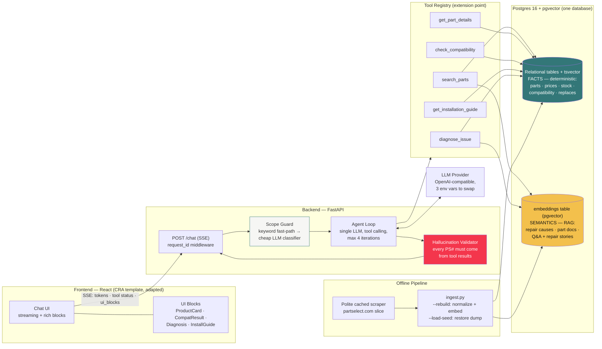
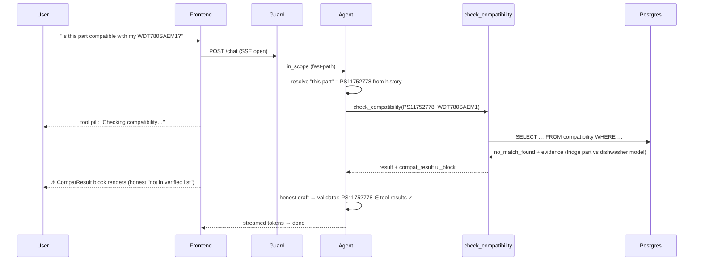

# PartSelect Chat Agent

> A grounded PartSelect chat agent that takes a customer from symptom to a
> verified part — with measured accuracy.

[](https://github.com/ScooterStuff/case-study/actions/workflows/ci.yml)

<!-- demo GIF: record per docs/media/README.md, then uncomment

-->

Scoped to **refrigerator and dishwasher parts**: diagnose a symptom, find the
right part, verify it fits your model, and get install help — in one
conversation, with rich in-chat components and zero invented part numbers.

## Quickstart

Datasets and a database seed are **pre-committed** — no scraping and no
embedding key needed to run (`ingest.py --load-seed` happens automatically).

```bash
# Docker (zero local toolchain)
cp .env.example .env           # add your LLM key — or skip and use mock mode:
MOCK_LLM=1 MOCK_EMBEDDINGS=1 docker compose up --build
# → UI on http://localhost:3000, API on http://localhost:8000 (OpenAPI at /docs)

# Local dev
cp .env.example .env && make setup
docker compose up -d db && make ingest
make dev
```

Try the three canonical queries (also seeded as suggestion chips in the UI):

1. `How can I install part number PS11752778?`
2. `Is this part compatible with my WDT780SAEM1 model?` _(as a follow-up — pronouns resolve)_
3. `The ice maker on my Whirlpool fridge is not working. How can I fix it?`

### Photo → model number (you're elbows-deep in a dishwasher)

An extra button in the composer turns the UX into a real repair companion:

- 📷 **Photo → model number** — snap or upload the appliance sticker; client-side OCR (Tesseract.js, lazy-loaded so the bundle isn't paid up-front) extracts the model number and pre-fills the next message as either a parts search or a compatibility check, depending on the conversation so far.

### "How I know this" (honesty trace)

Every assistant message has a collapsible **trace panel** showing exactly which tools the agent called, the inputs it sent, a one-line summary of each result, and the validator's verdict on every part number mentioned (✓ verified, ✗ stripped, • unknown). Most chatbots ask for trust; this earns it on purpose.

## Eval results (the part most chatbots skip)

The agent is **measured**, not vibes-checked: a 40-case harness replays
multi-turn conversations through the live SSE API and asserts tool selection,
answer content, scope behavior, and a mechanical hallucination check.

Full per-case table and methodology: [`eval/RESULTS.md`](eval/RESULTS.md) ·
cases: [`eval/cases.json`](eval/cases.json). Regenerate with `make eval`.
_The committed table is from the scripted `MOCK_LLM` client (provenance is in
the table's metadata line); re-run with your key for real-model numbers._

## Architecture

A user message first hits the **scope guard** (keyword fast-path, then a cheap
classifier only when needed — latency matters). In-scope messages go to a
**single tool-calling agent**: facts that must never be wrong (prices, stock,
compatibility) are answered from **relational tables via deterministic SQL**,
while fuzzy natural language (symptoms, "the thing that sprays water") is
answered via **RAG over pgvector embeddings in the same database** — which also
lets semantic hits JOIN prices and stock in one query. Every tool can attach a
**ui_block**, which the frontend renders as a rich component mid-stream. Before
the final answer flushes, a **validator** rejects any part number that didn't
come from a tool result. The tool registry is the extension point: a new
appliance is new data plus an enum value.

**Compatibility is a database join, never an LLM guess** — and the data layer is
honest about its limits: a miss is reported as _"not in our verified list"_
(the scraped cross-reference is partial), never a hard "incompatible".



<details>
<summary>Sequence diagram — the deterministic compatibility path</summary>



</details>

## Features

- **Streaming chat** with tool-status pills ("Checking compatibility…") and a
  hold-and-validate final flush — tokens appear fast, invented part numbers never do.
- **Rich blocks** rendered mid-stream: product cards (price, stock, difficulty,
  rating), compatibility verdicts (✓/⚠/✗ + evidence), ranked
  diagnosis with expandable causes, install guides (difficulty, time, video,
  real customer repair stories).
- **Chat-native navigation**: "Check fits my model" and "Install guide" buttons
  send templated messages — the conversation _is_ the UI.
- **Scope guard**: regex fast-path (no extra LLM call for obvious cases), cheap
  classifier for the rest, graceful on-brand deflections, injection handling
  (embedded payloads are ignored while the legitimate question is answered).
- **Hallucination gate**: every `PS#` in a draft must exist in this
  conversation's tool results — violations are retried, then stripped and
  logged (`backend/data/hallucination_log.jsonl` stays empty across the eval).
- **Keyless demo mode**: `MOCK_LLM=1` swaps in a deterministic, tool-faithful
  scripted client — CI and demos run with zero API keys.

<!-- screenshots: docs/media/block-*.png (see docs/media/README.md) -->

## Testing & quality

> Evals measure whether the _agent_ is right; tests measure whether the _code_
> is correct. They're separate layers on purpose.

| Layer         | What                                                                 | Run         |
| ------------- | -------------------------------------------------------------------- | ----------- |
| Unit (many)   | parsers, retrieval SQL, guard, validator, tools, agent loop          | `make test` |
| Integration   | FastAPI TestClient over real Postgres+pgvector (embedded `pgserver`) | `make test` |
| Frontend      | Jest + RTL: blocks, SSE chunk-reassembly, composer keys              | `make test` |
| Agent quality | 40-case eval harness                                                 | `make eval` |

Backend coverage **83%** (CI gate ≥80%). Lint: ruff (+bandit rules) and
ruff-format, enforced by CI and pre-commit. CI: backend / frontend on
every push; eval is a manual workflow (needs an LLM secret, costs money).

## Design decisions (full log: [`playbook/TRADEOFFS.md`](playbook/TRADEOFFS.md))

> Library-level choices (FastAPI vs Flask, pgvector vs Pinecone, Tesseract.js
> vs cloud OCR, …) and what would make us revisit them are catalogued in
> [`docs/TECH_STACK.md`](docs/TECH_STACK.md).

| Decision                                       | Why                                                  | Revisit when                  |
| ---------------------------------------------- | ---------------------------------------------------- | ----------------------------- |
| One Postgres for facts **and** vectors         | semantic hits JOIN price/stock in-db; one `up`       | ~1M embeddings                |
| Raw SQL, no ORM                                | ~10 queries; the SQL _is_ the architecture demo      | schema churn 3×               |
| Single agent + tool registry (no multi-agent)  | lower latency, simpler failures, easier evals        | tools stop fitting one prompt |
| Buffer-and-release final prose                 | mechanical zero-hallucination guarantee beats ~100ms | sub-100ms budgets             |
| Two-mode LLM/embeddings (real / scripted mock) | keyless CI + demos; rails provable without spend     | never — it's free             |

## Extensibility

- **New appliance**: add an entry to [`backend/app/appliances.toml`](backend/app/appliances.toml)
  (canonical name + keywords), drop seed URLs into `scraper/seeds.py`, and
  re-ingest. The Pydantic tool schema, scope guard, and system prompt all
  rebuild from that TOML at import time — no other code changes.
- **Swap LLM provider**: 3 env vars (`LLM_BASE_URL`, `LLM_API_KEY`, `LLM_MODEL`)
  — anything OpenAI-compatible works (tested against the mock + OpenAI shapes).
- **Scale path**: Postgres+pgvector already production-shaped; move sessions
  from in-memory to Redis (one class), add per-tool caching, ship the existing
  structured request-id logs to OTel/Datadog.

## Limitations (honest edition)

- **Partial compatibility data** — PartSelect's cross-reference tables are
  paginated; the scrape keeps the first page per part, so verdicts are
  "verified fit" vs "not in our _verified_ list", never a hard no. By design.
- **Catalog slice** — 34 real parts (the build environment couldn't bulk-fetch
  raw HTML; `python -m scraper.scrape` scales the same pipeline to 150+ on a
  normal machine). All spec-critical records are present and real.
- Single-locale USD pricing, in-memory sessions (Redis swap noted above),
  committed seed currently embeds with the mock hasher until a real embedding
  run replaces it.

## How this was built

Built AI-natively: a Claude agent executed the planning docs in
[`/playbook`](playbook/) end-to-end — scraping, data layer, agent, evals, UI,
CI — with every deviation from the plan logged in
[`playbook/DEVIATIONS.md`](playbook/DEVIATIONS.md) and human review on top.
The playbook is left in the repo deliberately: it's part of the engineering story.

## Dev guide

```bash
make setup     # venv + deps + pre-commit hooks
make test      # pytest (+coverage) and jest
make lint      # ruff check + format
make smoke     # the three spec queries against :8000
make eval      # regenerate eval/RESULTS.md
```

API docs: FastAPI's OpenAPI at `http://localhost:8000/docs`.
See [`CONTRIBUTING.md`](CONTRIBUTING.md). MIT licensed.
