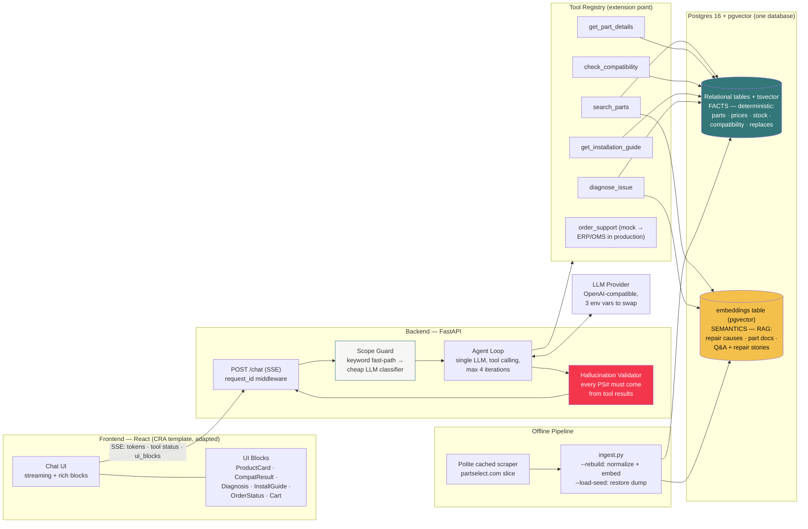
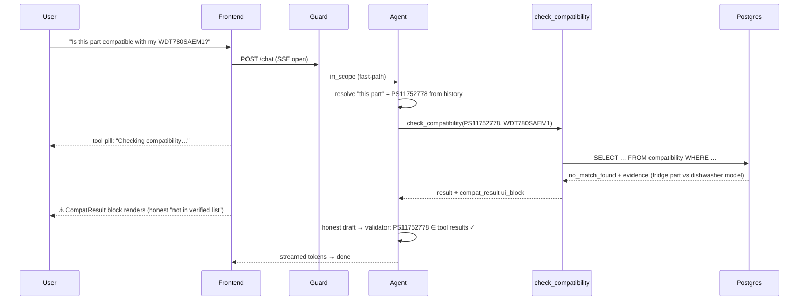

# ARCHITECTURE.md — System Diagram

This Mermaid diagram is the canonical architecture picture. Embed it verbatim
in the README (§Architecture) — GitHub renders Mermaid natively. Keep it in
sync if the design changes; this file is the single source of truth.

## The one-paragraph narration (reuse in README)

A user message first hits the **scope guard** (keyword fast-path, then a cheap
classifier only when needed — latency matters). In-scope messages go to a
**single tool-calling agent**: facts that must never be wrong (prices, stock,
compatibility) are answered from **relational tables via deterministic SQL**, while
fuzzy natural language (symptoms, "the thing that sprays water") is answered
via **RAG over pgvector embeddings in the same database** — which also lets semantic hits JOIN prices and stock in one query. Every tool can attach a **ui_block**, which the
frontend renders as a rich component mid-stream. Before the final answer
flushes, a **validator** rejects any part number that didn't come from a tool
result. The tool registry is the extension point: a new appliance is new data
plus an enum value; real order support is the same `order_support` schema with
an ERP client behind it.

## Sequence (compatibility check, the deterministic path)

